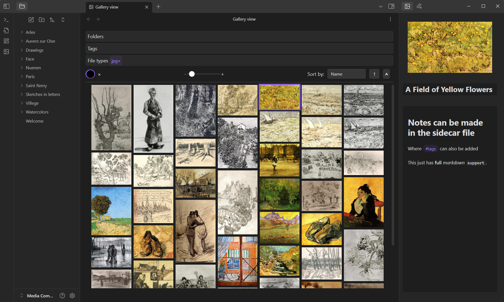
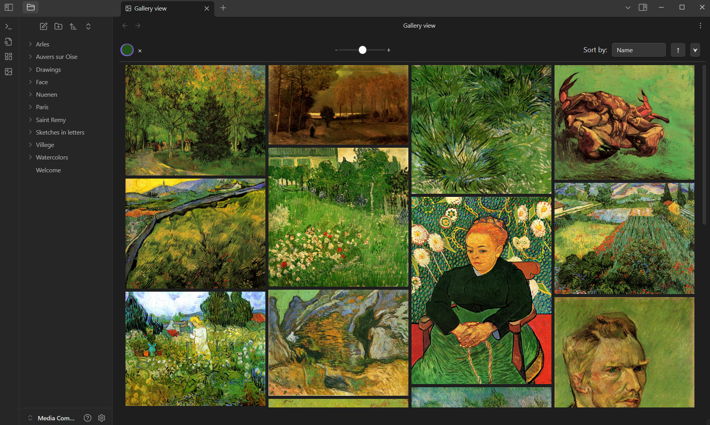

# Media Companion Plugin for Obsidian

> [!CAUTION]
> This plugin creates and edits a file for each media file. Before using it on any serious vault, **make a backup**.

> [!WARNING]
> The file types this plugin is known to work for have been added in the default settings of the plugin.
> Other formats that Obsidian supports *may* work but they are **not** (yet) officially supported.
> Video files, for example, can currently break the gallery.

A companion plugin for [Obsidian](https://obsidian.md/) that creates a gallery with all your media files. The plugin aims to let you search through these files. Additionally, it creates sidecar files for each media file, to allow for adding notes, tags, and so on.

## Features

Search through your files based on folders, tags, or file types.

More complex searching can also be done, like searching by color (**without** use of AI!)

*Art shown in the images is from [this dataset of Van Gogh paintings](https://www.kaggle.com/datasets/ipythonx/van-gogh-paintings)*

## Planned features

- [ ] Allow editing of frontmatter data for sidecar files
- [ ] More file type compatibility
	- [ ] Video files (mp4, webm)
	- [ ] Audio files (mp3, wav)
	- [ ] 3d objects (obj, blender files, gltf)
- [ ] Gallery UI overhaul
	- [ ] Make the search more friendly on mobile
	- [ ] Make the interface more managable
	- [ ] Make everything look nicer in general

## Contributing

If you wish to contribute to the plugin, feel free to open a pull-request or an issue.
If you're thinking about implementing a large feature, please open an issue first or contact me on discord at `n_1ck` 
so we can figure out if it's a good fit for this plugin.

# Attribution

Original SuggestInput adapted from https://github.com/agustinl/MC-input, available under the MIT license.
